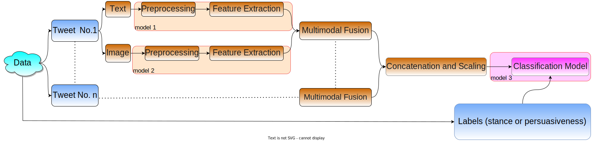

# A General Framework for Multimodal Argument Persuasiveness Classification of Tweets

## Introduction
This repository houses the official implementation of A General Framework for Multimodal Argument Persuasiveness Classification of Tweets, alongside the paper accepted for presentation at the Argument Mining workshop at the EMNLP 2023.

In the ImageArg shared task at ArgMining 2023, the classification of tweet stances using both text and images and the prediction of image impact on tweet persuasiveness were aimed for. The approach secured 3rd team, achieving F1 scores of 0.8273 (stance classification) and 0.5281 (image influence prediction), and emerged as the top performer across both tasks when considering overall performance.
## Framework Design

The framework, used for 5 submissions, consists of three main models:

### Model 1 and Model 2
- Model 1 and Model 2 extract text and image features from each tweet as vectors of sizes `a` and `b`, respectively.

### Multimodal Fusion
- Multimodal fusion combines these vectors into a single vector of size `c`, where `c = a + b`.

### Formation of Feature Matrix
- The n tweet feature vectors jointly form a matrix `C` ∈ ℝ<c×n>.
- Alongside the n task-specific labels, they serve as input for Model 3.
  

## Obtaining Data

To access the necessary datasets, please follow these steps:

1. **Download the Data:**
    - Access the datasets from [ImageArg-Shared-Task repository](https://github.com/ImageArg/ImageArg-Shared-Task).
    - Place the dev and train sets in the following path: `data/`.
    - Store the test sets in: `test/data/`.

2. **Organize Image Folders:**
    - Merge the image folders for both 'gun control' and 'abortion' into a single folder named ''image''.
    - This results in two folders:
        - `data/images/image/`
        - `test/data/images/image/`
## Requirements

### Python Version
- Python 3.10.11

### Installing Dependencies
To install the required packages, run the following command:

"pip install -r requirements.txt"

## Running the Framework

To execute the framework, use the following command:

"python3 main.py --t 'task' --a 'approach'"

Replace 'task' with either 'AS' (Argument Stance) or 'IP' (Image Persuasiveness), specifying the intended task.
Use 'approach' to denote the approach number. Approaches range from 1 to 5 for submissions and may include additional experiments (currently Approach 6 for AS and Approaches 6, 7 for IP).
Example Command:

"python3 main.py --t AS --a 3"

After executing the framework, the output will display the dev and test F1 Scores for the specified task and approach.
